<p>
	
</p>

# Feer

**`Feer2`** New front-end tool integration environment. &ensp;🚀 

> The naming inspiration comes from **`F`** ront- **`E`** nd&ensp; Engine **`er`**, that is "FEer", &ensp;such as "JAVAer"、  "PHPer"

[**中文**](./README.md)

<p align='center'>
  
</p>

### commander

- global
```bash
npm i feer2 -g
```
- usage
```
feer2 <your-project-name>
```
- or
```bash
npx feer2 <your-project-name>
```

### support PC and H5 scenario selection.

During the creation process using the `feer2` command, 
template selection is provided:

```bash
? Which type do you want to create? (Use arrow keys)
❯ ES - (base on the webpack & es)
  React - (base on the webpack & react)
  Vite - (base on the vitejs & react)
```

## directory structure

```c
├── .babelrc ---> Babel configuration file
├── .gitignore ---> Git filtering rule
├── .eslintrc ---> ESLint configuration file
├── .eslintignore ---> ESLint filtering rule
├── README.MD
├── package.json
├── build/dist ---> Output folder
├── config ---> Configuration folder(`*`)
├── images ---> Image resource file (this folder can be deleted when using CDN)
└── src ---> Source folder
```

### configuration folder

```c
├── env.js ----> 基础环境变量
├── dev.js ----> 开发环境配置
└── prod.js ---> 生产环境配置
```

### source folder

```c
├── libs ---> Can store incoming third party library files
├── mods ---> Module business logic
├── index.js ---> The entry file: index.js
└── sass ---> Sass, Source code folder, customizable
```

### build/dist folder

```c
├── index.html ---> Html template file
├── js ---> Javascript source folder
├── css ---> Css source folder
└── img ---> Image resource file (this folder can be deleted when using CDN)
```


### features

* Based on the most popular package compilation scheme
* Fast modular packaging to minimize bundles
* Tree- Shaking helps you remove useless code
* Support single/multiple page development
* Support Proxy access interface
* Emulation API based on MockJS
* Simple and convenient configuration,fast packaging
* Support Sass, Less powerful CSS extension language
* Flexible routing configuration
* Supports automatic browser opening (automatically gets the local IP address)
* Through the test of many projects, continuous improvement and upgrading


### License

[MIT](./LICENSE)
 

